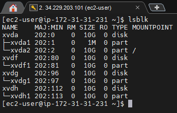
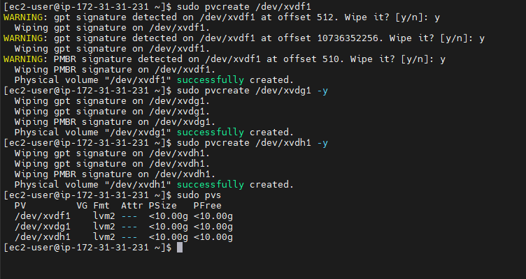
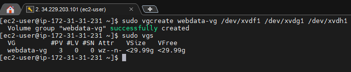
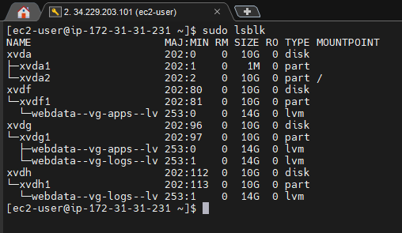
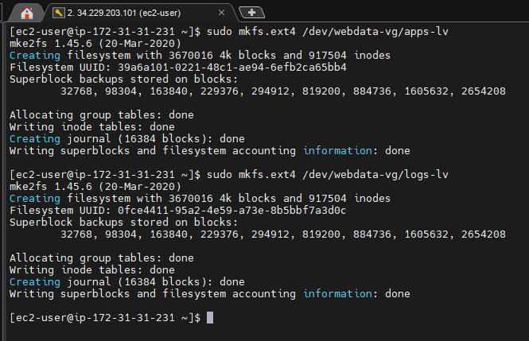

# WEB SOLUTION WITH WORDPRESS

## STEP 1 - PREPARE A WEB SERVER

### Volumes Created

---
### Physical Volumes Created

---
### Webdata Volume Group Created

---
### Logical Volumes Created

---
### Verifying The Entire Setup

---
### Formatting Logical Volumes With Ext4 Filesystem

---

## STEP 2 - PREPARE THE DATABASE SERVER (DB SERVER)

## STEP 3 - INSTALL WORDPRESS ON YOUR WEBSERVER EC2

## STEP 4 - INSTALL MYSQL ON YOUR DB SERVER EC2

## STEP 5 -  CONFIGURE DB TO WORK WITH WORDPRESS

## STEP 6 - CONFIGURE WORDPRESS TO CONNECT TO REMOTE DATABASE