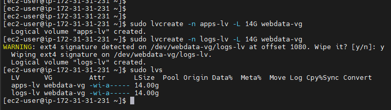
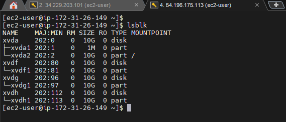
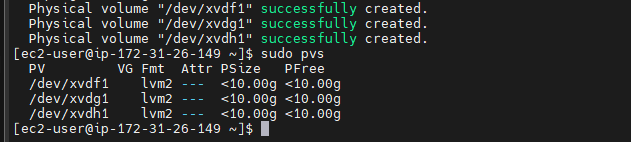
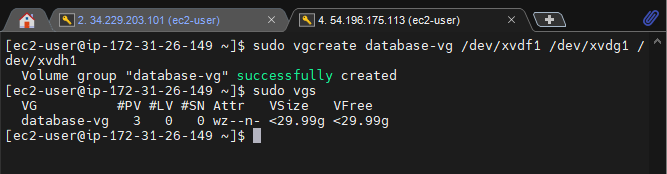
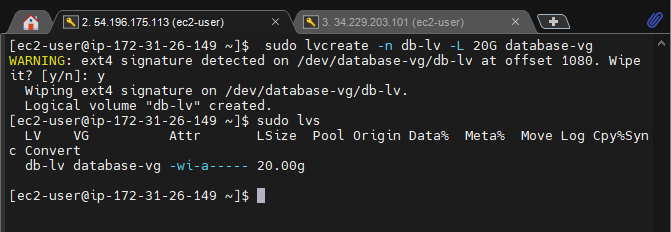
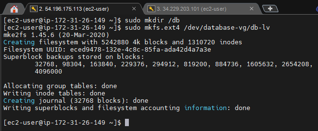
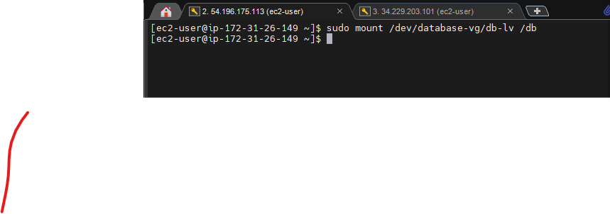
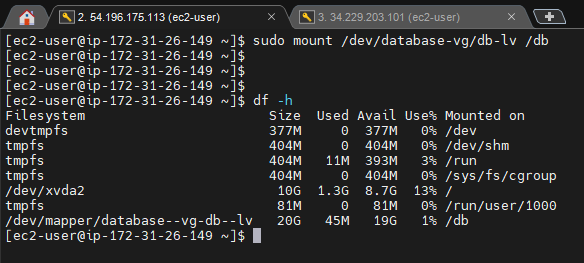
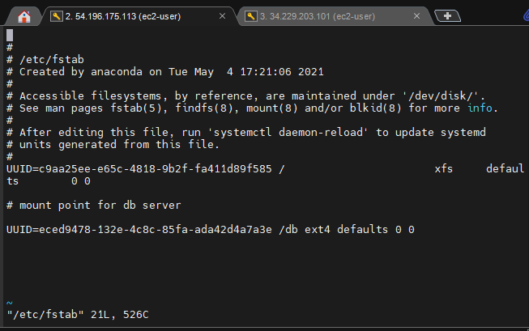

# WEB SOLUTION WITH WORDPRESS

## STEP 1 - PREPARE A WEB SERVER

### Volumes Created

---
### Physical Volumes Created

---
### Webdata Volume Group Created

---
### Logical Volumes Created

---
### Verifying The Entire Setup

---
### Formatting Logical Volumes With Ext4 Filesystem

---

### Creating var/www/html && home/recovery/logs Directory

---
### Mounting Logical Volumes on var/www/html and /var/log

---

---
### Update /etc/fstab File So That The Mount Configuration Will Persist After Restart Of The Server

---
### Test Configuration And Reload Daemon

---
### Verifying Mount Setup

---

## STEP 2 - PREPARE THE DATABASE SERVER (DB SERVER)

### DB Server Volumes Created

---
### DB Physical volumes Created

---
### DB Volume Groups Created

---
### DB Logical Volume Created

---
### Formatting DB Logical Volumes With Ext4 Filesystem

---
### Creating /db Mount Point Directory

---
### Mounting DB Logical Volume to /db

---
### Verifying DB Mount Setup

---
### Update DB /etc/fstab File So That The Mount Configuration Will Persist After Restart Of The Server

---
### ### Test Configuration And Reload Daemon

---

## STEP 3 - INSTALL WORDPRESS ON YOUR WEBSERVER EC2

## STEP 4 - INSTALL MYSQL ON YOUR DB SERVER EC2

## STEP 5 -  CONFIGURE DB TO WORK WITH WORDPRESS

## STEP 6 - CONFIGURE WORDPRESS TO CONNECT TO REMOTE DATABASE